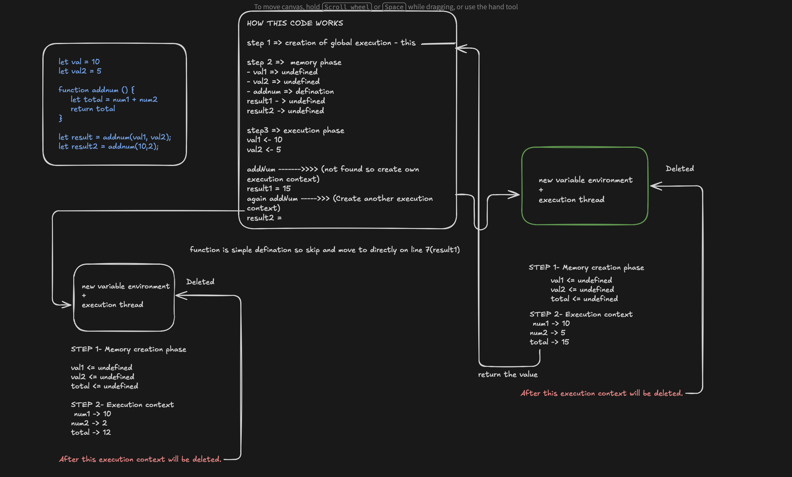

// JAVASCRIPT EXECUTION CONTEXT CODE

/*
{} -> (THIS) Global EXECUTION CONTEXT(EC) always created , execute in thread as js is single threaded

 1. global execution context refer as (this)
 2. functional execution context
 3. eval execution context 

 there are 2 phase to process this
 >> memory creation phase : only allocate memory not perform arithematic operation
 >> execution phase 

```
let val = 10
let val2 = 5

function addnum () {
    let total = num1 + num2
    return total
}

let result = addnum(val1, val2);
let result2 = addnum(10,2);
```


